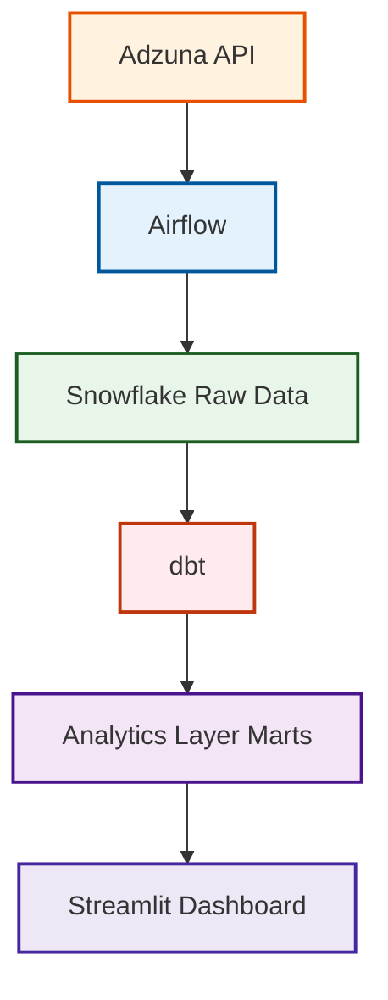

#  Job Market Tracker 

## Overview

This project is an end-to-end data engineering pipeline that collects, processes, and analyzes job market data from the **Adzuna API**. It demonstrates how to build a production-grade pipeline with:

- Reliable job offer ingestion from an external API (rate limiting, pagination, exponential backoff retry)
- Unified data modeling with automatic skill extraction (NLP keyword matching)
- Workflow orchestration with Apache Airflow
- Data warehousing in Snowflake (RAW layer)
- ELT transformation & automated testing with dbt
- Interactive analytics dashboard with Streamlit

---

## Architecture



---

## Data Pipeline

### 1. Data Collection – Adzuna API
- Fetches job offers using multiple search queries: `"data engineer"`, `"data engineer python"`, `"ingénieur données"`
- Handles **rate limiting**, **pagination**, and implements an **exponential backoff retry** mechanism for reliable collection
- Normalizes all offers into a unified `JobOffer` schema regardless of source format
- Automatically extracts technical skills from job descriptions using **NLP keyword matching**

### 2. Data Loading – Snowflake (RAW Layer)
- Loads raw job offers into the `RAW_JOBS` table via `write_pandas` for optimized bulk inserts
- Deduplicates records on load to prevent duplicate entries across DAG runs

### 3. Data Quality Check
- Validates that at least **10 job offers** were collected per run
- Fails the DAG early if the volume threshold is not met, preventing bad data from propagating downstream

### 4. Data Transformation – dbt (ELT)
- **Staging layer** – cleans, types, and standardizes raw data (`stg_jobs`)
- **Marts layer** – analytics-ready models for business consumption
- Automated **dbt tests** on every run (not-null, unique, accepted values)
- dbt **documentation auto-generated** at the end of each pipeline run

---


## Analytics Layer (dbt Models)

### dbt Lineage Graph

[](https://postimg.cc/Yvw11h15)

### Staging – `stg_jobs`
Cleans and standardizes raw job data:
- Unique job ID validation
- Non-null checks on title, company, published date, collected date

### Marts

#### `job_trend`
Monthly job posting trends by query and source.

#### `monthly_stats`
Aggregated monthly statistics:
- Total job count per month/year
- Distribution by job type

#### `skill_trends`
Tracks skill mentions extracted from job descriptions:
- Skill name
- Mention count over time

---

## Business Insights

This pipeline enables answering questions such as:
- How is demand for data engineering roles evolving month over month?
- Which technical skills (Python, Spark, Airflow…) are most in demand?
- What are the hiring trends in the French job market for data roles?

---

## How to Run

### 1. Configure Airflow Variables

In the Airflow UI, add the following variables:

```
ADZUNA_APP_ID=your_adzuna_app_id
ADZUNA_APP_KEY=your_adzuna_app_key
```

### 2. Configure Airflow Connection

Create a connection named `jmt_snowflake_default` with:

| Field | Value |
|-------|-------|
| Conn Type | Snowflake |
| Login | your Snowflake username |
| Password | your Snowflake password |
| Schema | `JOBMARKET` |
| Extra (JSON) | `{"account": "...", "warehouse": "COMPUTE_WH", "snowflake_schema": "PUBLIC"}` |

### 3. Run the DAG

- Activate `job_market_tracker` in the Airflow UI
- Trigger manually or wait for the daily schedule at 06:00 UTC

### 4. Run the Dashboard

1. Install the required dependencies:
   ```bash
   pip install streamlit snowflake-connector-python pandas plotly
   ```
2. Start the Streamlit dashboard
    ```bash
   streamlit run dashboard.py
   ```


---

## Results

### Airflow DAG
[](https://postimg.cc/Th955CtZ)

### Snowflake Tables
[](https://postimg.cc/JtqHHPp2)
[](https://postimg.cc/9zpwwJx3)


