# Job Market Tracker

## Overview
This project is an end-to-end data engineering pipeline that monitors the French tech job market by collecting and analyzing real-time offers from the **France Travail API**. 

It implements a production-grade architecture designed around three core stages:
- **Orchestration & Ingestion:** Automated data collection with Apache Airflow, featuring built-in rate-limiting and text parsing (salary normalization & skill extraction).
- **Storage & Transformation:** Scalable ELT data warehousing inside Snowflake, fully modeled and tested using dbt.
- **Analytics & BI:** Clean business insights delivered through an interactive Metabase dashboard.
---

## Architecture

```mermaid
flowchart LR
    %% Configuration globale du layout
    direction LR
    
    %% Noeuds principaux
    API["🌐 France Travail API"] 
    Airflow["🚀 Apache Airflow"]
    Metabase["📊 Metabase Dashboard"]

    %% Zone Snowflake
    subgraph Snowflake ["❄️ Snowflake Cloud Data Warehouse"]
        direction LR
        Raw[("📁 RAW_JOBS<br/>(Landing Layer)")]
        dbt[["🛠️ dbt Core<br/>(Transformations)"]]
        Marts[("🎯 ANALYTICS_MARTS<br/>(Business Layer)")]
        
        Raw --> dbt --> Marts
    end

    %% Flux principaux
    API -->|Ingest| Airflow
    Airflow -->|Load| Raw
    Marts -->|Query| Metabase

    %% Styles CSS personnalisés (Modern & Clean)
    classDef external fill:#f8f9fa,stroke:#343a40,stroke-width:2px,color:#212529,font-weight:bold;
    classDef orchestrator fill:#e8f0fe,stroke:#1a73e8,stroke-width:2px,color:#1557b0,font-weight:bold;
    classDef warehouse fill:#ffffff,stroke:#4a5568,stroke-width:2px,color:#2d3748;
    classDef dbtStyle fill:#fff5f5,stroke:#e53e3e,stroke-width:2px,color:#9b2c2c,font-weight:bold;
    classDef bi fill:#f3f0ff,stroke:#7048e8,stroke-width:2px,color:#5733d6,font-weight:bold;
    
    %% Application des styles
    class API external;
    class Airflow orchestrator;
    class Raw,Marts warehouse;
    class dbt dbtStyle;
    class Metabase bi;

    %% Style du Subgraph
    style Snowflake fill:#f1f3f5,stroke:#ced4da,stroke-width:2px,stroke-dasharray: 5 5,color:#495057,font-weight:bold;
```



---

## Data Pipeline

### 1. Data Collection – France Travail API
- Collects job offers using multiple search queries (`"data engineer"`, `"data engineer python"`, `"ingénieur données"`)
- Implements **rate limiting**, **pagination**, and **exponential backoff retries**
- Filters internships, freelance, and alternance offers during collection
- Normalizes data into a unified `JobOffer` schema
- Extracts technical skills using **rule-based keyword matching**
- Parses and normalizes salaries from unstructured French text

> **Note:** Adzuna was evaluated as a first data source but discarded due to poor data quality (only 9/80 offers had skills and salary populated). France Travail provides richer structured data directly from the API.

### 2. Data Loading – Snowflake (RAW Layer)
- Bulk loads job offers into `RAW_JOBS` using Snowflake's `write_pandas`
- Deduplicates records to ensure idempotent loading across DAG runs

### 3. Data Quality Check
- Validates that at least **10 job offers** are collected per run
- Fails the DAG early if the threshold is not met, preventing downstream data pollution

---

## Analytics Layer (dbt)

### dbt Lineage Graph
[.png)](https://postimg.cc/R3bFr8Sc)

### Models
- **Seeds:** Reference tables for accepted contract types and excluded job platforms
- **Staging (`stg_jobs`):** Cleans, deduplicates, and standardizes raw job data
- **Marts:**
  - `jobs_clean` – Curated dataset for analysis
  - `job_trend` – Monthly hiring trends with a 3-month rolling average
  - `monthly_stats` – Monthly hiring and salary metrics
  - `skill_trends` – Skill demand over time
  - `skills_salary` – Average salary by technical skill

### Data Quality
- Schema tests (`unique`, `not_null`, `accepted_values`)
- Custom tests for salary consistency, publication dates, and data freshness
---

## Business Insights

This pipeline enables answering questions such as:
- How is demand for data engineering roles evolving month over month?
- Which technical skills (Python, Spark, Airflow…) are most in demand?
- Which skills are the best paid on the French market?
- Which companies recruit the most data engineers in France?

---

## How to Run

### 1. Configure Airflow Variables
In the Airflow UI, add the following variables:
```
FRANCETRAVAIL_CLIENT_ID=your_client_id
FRANCETRAVAIL_CLIENT_SECRET=your_client_secret
```

### 2. Configure Airflow Connection
Create a connection named `jmt_snowflake_default` with:

| Field | Value |
|-------|-------|
| Conn Type | Snowflake |
| Login | your Snowflake username |
| Password | your Snowflake password |
| Schema | `JOBMARKET` |
| Extra (JSON) | `{"account": "...", "warehouse": "COMPUTE_WH", "snowflake_schema": "PUBLIC"}` |

### 3. Configure dbt
Add a profiles.yml file  with your Snowflake credentials in dbt folder:
```
jmt:
  outputs:
    dev:
      type: snowflake
      account: your-account.region
      user: your_username
      password: your_password
      role: your_role
      database: JOBMARKET
      warehouse: COMPUTE_WH
      schema: PUBLIC
      threads: 4
```
### 4. Configure Metabase
Open metabase and add a Snowflake database connection:

| Field | Value |
|-------|-------|
| Account name | `your-account.region` (from your Snowflake URL) |
| Username | your Snowflake username |
| Password | your Snowflake password |
| Warehouse | `COMPUTE_WH` |
| Database name | `JOBMARKET` |
| Schema | `PUBLIC_MARTS` |


### 5. Run the DAG
- Activate `job_market_tracker` in the Airflow UI
- Trigger manually or wait for the daily schedule at 06:00 UTC
---

## Results

### Airflow DAG
[](https://postimg.cc/kBndcs98)

### Snowflake Tables
[](https://postimg.cc/Th2y4ZV6)
[](https://postimg.cc/kB7LPbmS)

### Metabase Dashboard

[](https://postimg.cc/pmhwstvh)

Key visualizations:
- **KPIs** — total offers, top skill of the month
- **Job Trend** — monthly offers + 3-month rolling average
- **Top Skills** — most demanded skills this month
- **Skills vs Salary** — average salary per skill
- **Top Companies** — most hiring companies
---


